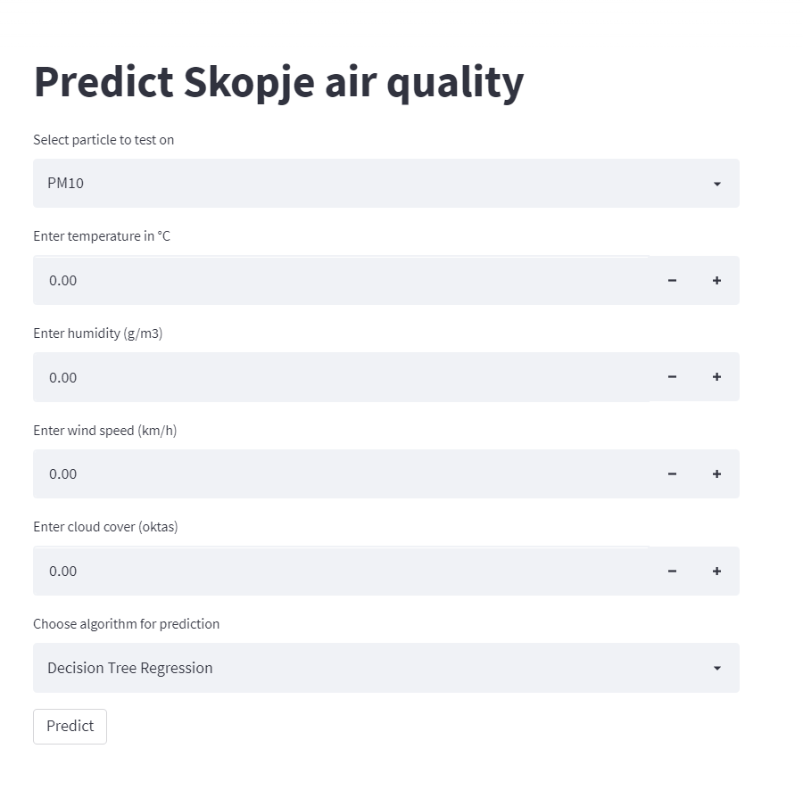

# Skopje Air Quality Prediction

LINK TO THE APP = https://share.streamlit.io/petarfinki/skopje-air-quality-prediction/main/app.py

## Project Introduction

Air is one of the major components for all living organisms on the earth. From the last 50 years, still pollution is increasing because of urbanization, industrialization, automobiles, power plants, chemical activities, and some of the other natural activities such as agricultural burning, volcanic eruptions, and wildfires. All these activities cause the pollution growth, particularly particulate matter (PM) is one of the significant reason for air pollution.The heavy concentration of particulate matter of size PM10 and PM2.5 is seriously caused adverse health effect.There are a strong relationship between the particulate matter and other pollutant factors such as PM2.5, SO2, NO2, CO, PM10, O3, etc. 

The main goal of this project is to analyze the different machine learning techniques for forecasting the particles mentioned above. The proposed machine learning models are used for particles concentration prediction based on weather conditions. I collected the data from [Ministry of Environment and Physical Planning](https://air.moepp.gov.mk/?page_id=175) and [Skopje meteorological data](https://www.visualcrossing.com/weather/weather-data-services) to train the model. The data consists of hourly information about the meteorological data and particle measurements from January 1st till February 5th 2022.

The idea was always to use supervised learning - and to treat this as a regression problem rather than a classification problem. 

This project consists of 2 parts:
1. [**Air quality in Skopje: visualization and prediction**](https://github.com/petarfinki/Skopje-Air-Quality-Prediction/blob/main/skopje_air.ipynb)
2. [**Skopje air quality prediction web app**](https://share.streamlit.io/petarfinki/skopje-air-quality-prediction/main/app.py)

## Project Flow
1. Data preprocessing
2. Data visualization
3. Data transformation
4. Prediction using machine-learning algorithms

## Future Work

* This project can be very much expanded with weather and particles data since February 5th. That way we'll have more samples to predict better. 
* Other visualizations can be included
* The app can contain precaution messages based on the prediction result !

## References 
* [Forecasting Air Pollution Particulate Matter (PM2.5) Using Machine Learning Regression Models](https://www.sciencedirect.com/science/article/pii/S1877050920312060)
* [EDGAR - Emissions Database for Global Atmospheric Research](https://edgar.jrc.ec.europa.eu/country_profile/MKD)
* [Atmospheric particulate matter (PM2.5), EC, OC, WSOC and PAHs from NE–Himalaya: abundances and chemical characteristics](https://www.sciencedirect.com/science/article/pii/S1309104215303913)

*Petar Dimitrievski 02.05.2022*
